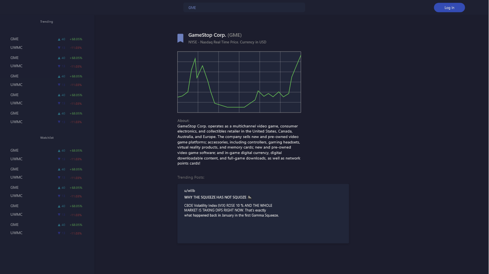
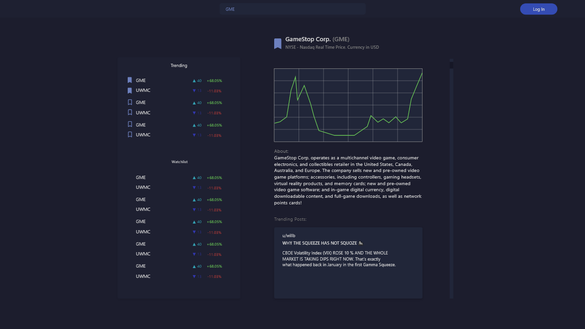
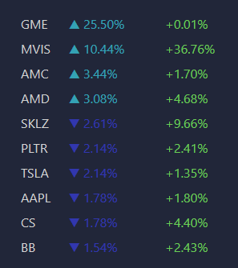
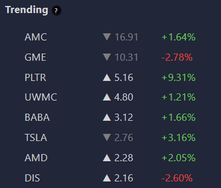

# User feedback
**User Test 1: (Prototype Stage)**
* After being shown two prototypes of the interface made in Adobe XD (see image 1 and 2 below), the user concluded that the interface seen in image 1 was more appealing, with the motivation that there was much non utilized space on the interface seen in image 2.
  * Response: We agreed with the user's arguments and decided to use the interface layout from image 1. 
* No units on the graph, it should be clear what timespans and priceranges the stock moves between.
  * Fix: Improved the graph for the first version, adding units and measurements to the graph as well as tools to modify the viewed area/timespan.
* No need to state "currency in USD" in the title of the stock view.
  * Fix: Decided to not explicitly state currency on every stock.
  * Note: This change was reverted later, but currency is specified in a specific prompt under the stock information. More on this change later.
* User suggested having separate buttons for logging in and signing up, motivated by the fact that this is the case in most other applications in the user's experience.
  * Fix: Added a button for signing up next to the log in button, but with inverted colors to make them distinct.
* No home screen, or at least no way for the user to transport to it without changing the URL manually.
  * Fix: Added a logo for the application in the top left corner which also works as a home button that transports the user to a view of posts regarding the five most trending stocks.
* Would be good to be able to see basic stock information, such as market cap, today's price range and close value.
  * Fix: Redesigned the layout to include a short section with stock information provided by the same yahoo finance api we use to get stock price data.
* User suggested that we provide more information about reddit posts than only username. Suggested data was upvotes and subreddit.
  * Fix: Decided to provide data on subreddit, username, upvotes and date posted in post view.
* User pointed out that many Reddit posts are based on media, such as videos or gifs, and that our prototype only showed text posts.
  * Response: We noted that we should list all different types of posts and provide functionality for all of these. Some, like images and gifs, were automatically supported by our implementation of markdown while others, such as youtube videos, required special handling. 

*layout 1*

*layout 2*

**User Test 2: (Mid Project)**
* Not clear that Reddit is the source of the data.
  * Fix: Added a title to the post view specifying that stocks are from Reddit while also presenting if the posts are regarding all stocks or only one, and in that case which stock.
* No interaction with images. Feels too static.
  * Fix: Added zoom effect to images on hover to provide sense of interaction.
* No error message when entering wrong password.
  * Fix: Added error message when entering wrong password.
* Unclear what metrics the trending score is based on.
  * Fix: Introduced a information button that generates a pop-up explaining the trending metric on hover.
* If some stock information is missing the placeholder data is just whitespace. User suggested either removing the attribute temporarily or explaining that the information is missing in some way.
  * Fix: Replaced whitespace with "N/A" (non-applicable) if information is missing.
* User could not find a particular stock he was looking for, and wanted information regarding which stocks you could and could not track with the app.
  * Fix: Created an information prompt stating that the website only shows stocks with a market cap over $2B+ market cap. Information prompt appears when not finding any matches during a search.
* The user was observed trying to click individual stock names in the sidebar to be transported to their pages. We deemed that the quality of user control and freedom was impaired by not being able to do this.
  * Fix: The user is now able to click on stock names to be transported to their pages.

**Mid-Project Review From Canvas**
* Suggestion that posts that contains media should be minimized by default and that the user should be able to expand it.
  * Response: Any given stock will most of the time not have many posts regarding it, and thus we regarded posts taking up space to not be a problem. Having posts expanded by default also allows users to quickly filter through information about the public sentiment of a stock, which adheres to the fundamental idea of the application.
* Reviewer gave same suggestion as previous user review to include information on which stocks the application tracks. See previous query for solution.
* Reviewer only thought we used data from one subreddit, which is not the case.
  * Fix: We have highlighted the subreddit in the post information span to make it clear which subreddit the posts are from, as well as presenting the fact that posts are from different sources.
* Reviwer suggested that there should be some information stating that data is loading while logging in or signing in.
  * Fix: Introduced an loading icon when signing in or logging in.
* Reviewer suggested that there should be another link to the original Reddit post at the bottom of a post (in addition to the one at the top of the post).
  * Response: We already have a link to the original Reddit post, and although it is not taking much space, our purpose with the website is to provide relevant information in the interface, and thus not intending for the user to visit every post on the Reddit website.
* Reviewer suggested that we should underline stock names in the sidebar to make it clear that they were clickable.
  * Response: We agree that it is essential that the user can understand how to navigate through the system, but since every user that have tested the website has found that you can click on stock names in the sidebar, in addition to the fact that we believe underlining the stock names would be aestethically displeasing, we decided to adjourn this easily implemented change until we find evidence that users can not navigate this part of the interface.

**User Test 3: (Late Changes)**

* Light blue and dark blue colors on trending indicators considered confusing since they contrast badly with dark blue background.
  * Fix: Changed the colors to shades of gray that contrasted better against the background. Images of both old blue indicators and new gray ones can be seen below.
* Information on sidebar view presented too concentrated.
  * This is required to fit the watchlist in logged in mode, and having completely different views was not deemed intuitive, so no change was made.
* Graph feels incomplete without buttons to instantly view certain time periods, e.g., 3 months, 1 year.
  * Fix: Added buttons to view 1 week back, 1 month back, 6 months back, 1 year back, 3 years back and maximum timeframe.
* User wanted to know how far back we stored Reddit posts.
  * Fix: We introduced a on-hover information button similar to the one in the sidebar which explains which Reddit posts are shown.
* When no information about *short percent of float* is available the field is formatted N/A%. Should be only N/A.
  * Fix: Removed percent sign if no information available.
* Inconvenient to navigate between sign in and log in pages, if you for example forgot account credentials.
  * Fix: Added links to both pages on respective pages. Stylized "Already have an account? *Log In*" as well as "New to Tickertracker? *Sign Up*".
* User questioned whether he would stay logged in after leaving the page.
  * Fix: To more clearly communicate system status we added a "remember me" button when logging in and signing up.
* We showed the user two versions of the website with different logos/home icons, one vertical and one tilted, and asked him which he preferred.
  * Result: The user answered that he preferred the tilted logo. This together with asking other people about the logo, but not always with the context of the complete website, led us to make the decision to go with the tilted icon.
* User wanted to know the currency of the stock information and also what "N/A" meant.
  * Fix: Added notes that appear dynamically which explain these two concepts if they are relevant.
  
Left: old trending indicator.
Right: new trending indicator.

